# SVUMS - SV Untereuerheim Mitgliedschaft System

Online membership application system for Sportverein 1945 Untereuerheim e.V.

Applicants fill out a form and can either receive a PDF by email, print, sign,
and upload the signed document — or sign directly on-screen during submission.
The club admin reviews, approves, or declines each application through a
built-in admin panel.


## Features

**Public**

- Dynamic membership form (Einzel, Kind, Familie) with live fee calculation
- Address autocomplete (PLZ, Ort, Strasse) via German postal data
- IBAN validation with automatic BIC and bank name lookup
- PDF generation of the membership declaration (WeasyPrint)
- Email confirmation to applicant with PDF attachment
- **Inline digital signature** — applicant can sign on-screen before submitting;
  signed PDF is generated immediately and the application advances straight to
  "Dokument hochgeladen" status
- Upload page for signed documents (scan/photo) — the traditional alternative
- Public status page to track application progress by Antragsnummer

**Workflow — Option A (print/sign/upload)**

- Application submitted: status "Neu", unsigned PDF sent to applicant and club
- Applicant prints, signs, scans/photos, uploads via the upload link in the email
- Status auto-advances to "Dokument hochgeladen", confirmation email sent
- Admin sets "In Bearbeitung", "Genehmigt" (welcome email), or "Abgelehnt"

**Workflow — Option B (inline digital signature)**

- Applicant draws signature on-screen at the final step of the form
- On submit: signed PDF generated immediately, stored, and emailed to applicant
- Status is set to "Dokument hochgeladen" immediately (no upload step required)
- Admin receives notification with green "Online unterschrieben" badge
- All downstream emails and admin actions (resend, PDF download) are
  signature-aware: they re-use the stored signed PDF rather than regenerating
  an unsigned blank

**Admin Panel**

- Dashboard with search, filtering by status, and pagination
- Detail view per application with all personal, membership, and SEPA data
- Status management with notes
- PDF download (serves the signed PDF for online-signed applications) and
  uploaded document viewer
- Email resend button (sends correct email template for each signature flow)
- CSV export of all applications
- SMTP configuration and test email from the UI
- **Admin upload**: Admin can upload a signed document for an application
  (e.g. when received by post)

**Admin Approval / Denial**

- **Approval**: Admin must sign digitally (draw, upload, or use saved signature).
  A cross-signed PDF is generated (applicant + admin signature), stored in S3,
  and emailed to the applicant with an explanation for their records. The
  approval page is a formal administrative confirmation document with
  membership details, Satzung link, Mandatsreferenz, and contact info.
- **Denial**: Admin must provide a reason; it is stored and delivered to the
  applicant via email and shown on the public status page.
- **Save and lock signature**: When signing (approval or cancellation), admin
  can optionally save the drawn/uploaded signature for future use.

**Admin Documents Area**

- Central view of all membership documents and cancellation letters
- Filter by "Alle" / "Mit Dokument" / "Ohne Dokument"
- For each application: view/download uploaded document, view/download
  approval document (when genehmigt), upload or replace document, delete
  documents
- Cancellation letters table: view, download, delete
- All documents stored in Tigris (S3-compatible) object storage

**Admin Cancellation Letters**

- Generate cancellation confirmation PDFs with member details
- Admin signs digitally (draw, upload, or saved signature)
- PDFs stored in S3 and listed in the Documents area

**PDF and Document Styling**

- Signature blocks use `page-break-inside: avoid` so greeting, signature, and
  label stay together (no awkward page breaks)
- Signature boxes use white background and neutral borders (no green) so
  inserted signatures blend in
- Formal approval document with full administrative content

**Security**

- CSRF protection (double-submit cookie) on form submission
- IBAN encryption at rest (Fernet AES, key derived from COOKIE_SECRET)
- Rate limiting on the submit endpoint (3 per 10 min per IP)
- Upload token expiry (30 days)
- Non-sequential, random Antragsnummer (prevents enumeration)
- Secure session cookies (HttpOnly, Secure, SameSite)
- Security headers (X-Content-Type-Options, X-Frame-Options, Referrer-Policy)
- Non-root container user


## Tech Stack

| Layer     | Technology                                                       |
|-----------|------------------------------------------------------------------|
| Backend   | Python 3.13, FastAPI 0.129, SQLAlchemy 2.0                      |
| Database  | Neon (serverless PostgreSQL)                                     |
| Storage   | Tigris object storage (S3-compatible) for uploaded/signed PDFs  |
| Frontend  | React 18, TypeScript, Vite 7, Tailwind CSS 3.4                  |
| Signature | react-signature-canvas (inline digital signing)                  |
| PDF       | WeasyPrint 68                                                    |
| Email     | aiosmtplib (async SMTP), Jinja2 HTML templates                   |
| Auth      | itsdangerous (signed session cookie)                             |
| Crypto    | cryptography (Fernet for IBAN encryption)                        |
| Hosting   | Fly.io (Frankfurt region), Docker multi-stage build              |


## Project Structure

```
svums/
  Dockerfile              Multi-stage build (Node frontend + Python backend)
  fly.toml                Fly.io deployment configuration
  backend/
    app/
      main.py             FastAPI app, middlewares, startup migrations
      config.py           Settings via environment variables
      database.py         SQLAlchemy engine and session
      models/             SQLAlchemy models (application, settings, cancellation_letter)
      routers/
        public.py         Form submission, fees, IBAN lookup, upload, status
        admin.py          Auth, CRUD, PDF, CSV export, SMTP settings
        address.py        PLZ/street autocomplete
      schemas/            Pydantic request/response models
      services/
        email.py          All email sending functions
        fees.py           Fee calculation logic
        pdf.py            PDF generation with WeasyPrint
        crypto.py         IBAN encrypt/decrypt (Fernet)
        storage.py        Tigris/S3 object storage (upload, download, delete)
      templates/
        beitrittserklaerung.html  PDF template (signature-aware)
        genehmigung_seite.html   Approval page (formal confirmation + signature)
        kuendigungsbestaetigung.html  Cancellation letter PDF
        email.html                Admin notification email
        email_confirmation.html   Applicant confirmation (flow-aware)
        email_status.html         Status update emails
  frontend/
    src/
      App.tsx             Routes
      pages/
        ApplicationForm   Main membership form (incl. inline signature)
        Success           Post-submit confirmation (flow-aware)
        Upload            Signed document upload
        StatusPage        Public status lookup (incl. decline reason)
        AdminLogin        Admin authentication
        AdminDashboard    Application list
        AdminApplicationDetail  Single application (approval/denial modals)
        AdminSettings     SMTP, admin signature, app configuration
        AdminCancellation Cancellation letter generation
        AdminDocuments    Document overview, upload, delete
      services/api.ts     All API calls, CSRF token handling, formatFee utility
      context/            Admin auth context
```


## Deployment

The app can be deployed to [Fly.io](https://fly.io) or [Railway](https://railway.app). The entrypoint uses `PORT` from the environment (default 8000), so it works on both platforms.

### Railway

1. Create a new project and add PostgreSQL (or use an external Neon DB).
2. Deploy from Dockerfile (Railway detects it automatically).
3. Set required variables in Railway dashboard:
   - `DATABASE_URL` — PostgreSQL connection string (from Railway Postgres or Neon)
   - `ADMIN_PASSWORD` — Secure admin password
   - `COOKIE_SECRET` — Random secret, min 24 chars: `python3 -c "import secrets; print(secrets.token_urlsafe(48))"`
   - `CORS_ORIGINS` — Your frontend URL, e.g. `https://your-app.railway.app`
   - `PUBLIC_BASE_URL` — Same as CORS_ORIGINS or your custom domain
4. Health check: Railway uses `/api/health` by default. Ensure the path is configured in your service settings.
5. If using object storage (Tigris/S3) for uploads, add `AWS_ACCESS_KEY_ID`, `AWS_SECRET_ACCESS_KEY`, `AWS_ENDPOINT_URL_S3`, `AWS_REGION`, `BUCKET_NAME`.

**Note:** Railway injects `PORT` (default 8080). The entrypoint listens on `$PORT`, so no extra config is needed.

### Fly.io

The app is hosted on [Fly.io](https://fly.io) in the Frankfurt (`fra`) region.

### Prerequisites

- [flyctl](https://fly.io/docs/hands-on/install-flyctl/) installed and authenticated
- A [Neon](https://neon.tech) PostgreSQL database
- Fly.io account

### Initial Setup (one-time)

```bash
# Create the Fly app
flyctl apps create svums --org personal

# Set required secrets
flyctl secrets set \
  DATABASE_URL="postgresql://..." \
  ADMIN_PASSWORD="your-secure-password" \
  COOKIE_SECRET="your-random-secret-min-32-chars" \
  PUBLIC_BASE_URL="https://svums.sv-untereuerheim.de"

# Provision Tigris object storage (sets S3 secrets automatically)
flyctl storage create -a svums
```

Generate a secure cookie secret:

```bash
python3 -c "import secrets; print(secrets.token_urlsafe(48))"
```

### Deploy

```bash
flyctl deploy
```

### Data Persistence

| Data | Where |
|------|-------|
| Applications, settings | Neon PostgreSQL (external, always persistent) |
| Uploaded signed documents | Tigris object storage (S3-compatible, always persistent) |
| Online-signed PDFs | Tigris object storage, key: `{antragsnummer}_signed.pdf` |
| Approval documents (cross-signed) | Tigris, key: `{antragsnummer}_approved.pdf` |
| Cancellation letters | Tigris object storage, key per document |
| Admin signature (optional) | `app_settings.admin_signature_base64` in Neon |

SMTP settings and the optional admin signature are stored in the `app_settings`
table in Neon and survive restarts and redeployments.

### Environment Variables / Secrets

| Name | How set | Description |
|------|---------|-------------|
| `DATABASE_URL` | `flyctl secrets set` | Neon connection string |
| `ADMIN_PASSWORD` | `flyctl secrets set` | Admin panel password |
| `COOKIE_SECRET` | `flyctl secrets set` | Session signing key (min 32 chars) |
| `PUBLIC_BASE_URL` | `flyctl secrets set` or `fly.toml [env]` | Absolute base URL used in emails and upload/status links |
| `AWS_ACCESS_KEY_ID` | auto (Tigris) | Set by `flyctl storage create` |
| `AWS_SECRET_ACCESS_KEY` | auto (Tigris) | Set by `flyctl storage create` |
| `AWS_ENDPOINT_URL_S3` | auto (Tigris) | Set by `flyctl storage create` |
| `AWS_REGION` | auto (Tigris) | Set by `flyctl storage create` |
| `BUCKET_NAME` | auto (Tigris) | Set by `flyctl storage create` |
| `CORS_ORIGINS` | `fly.toml [env]` | Allowed CORS origins |
| `COOKIE_SECURE` | `fly.toml [env]` | Set to `true` in production |
| `COOKIE_NAME` | `fly.toml [env]` | Session cookie name |
| `POSTHOG_KEY` | `flyctl secrets set` | PostHog project API key (optional; analytics disabled if unset) |
| `POSTHOG_HOST` | `fly.toml [env]` | PostHog host, default `https://eu.i.posthog.com` (optional) |
| `FORWARDED_ALLOW_IPS` | `fly.toml [env]` | Trusted proxy IPs/CIDRs for forwarded headers |

### First-Time Setup

1. Run `flyctl deploy`
2. Go to `https://svums.fly.dev/admin` (or your custom domain)
3. Log in with the password from `ADMIN_PASSWORD`
4. Navigate to Settings and configure SMTP (required for email delivery)


## Antrag-Workflow

```mermaid
flowchart TD
    START([Antragsteller ruft das Formular auf])
    START --> S0

    subgraph S0["Schritt 1 – Persönliche Daten & Mitgliedschaft"]
        direction TB
        P1[Geburtsdatum eingeben]
        P1 --> AGE{Alter am 1. Jan.?}

        AGE -->|"< 18 Jahre"| KIND["Antragstyp: Kind<br/>(Erziehungsberechtigte/r erforderlich)"]
        AGE -->|"≥ 18 Jahre"| ADULT[Erwachsener]

        ADULT --> FAM{"Kinder + 2. Elternteil<br/>angegeben?"}
        FAM -->|Ja| FAMILIE["Antragstyp: Familie<br/>96,– € / Jahr"]
        FAM -->|Nein| EINZEL[Antragstyp: Einzel]

        KIND --> KINDKAT{"Elternteil<br/>auch Mitglied?"}
        KINDKAT -->|"Ja – bis 14 J."| K1["12,– € / Jahr"]
        KINDKAT -->|"Nein – bis 14 J."| K2["24,– € / Jahr"]
        KINDKAT -->|"Ja – 14–18 J."| K3["24,– € / Jahr"]
        KINDKAT -->|"Nein – 14–18 J."| K4["36,– € / Jahr"]

        EINZEL --> EINZELKAT{"Altersgruppe<br/>am Stichtag?"}
        EINZELKAT -->|"bis 25 J."| E1["42,– € / Jahr"]
        EINZELKAT -->|"ab 25 J."| E2["54,– € / Jahr"]
    end

    S0 --> S1

    subgraph S1["Schritt 2 – SEPA-Lastschrift"]
        IBAN[IBAN eingeben]
        IBAN --> IBANVAL{IBAN gültig?}
        IBANVAL -->|Ja| AUTOFILL["BIC & Kreditinstitut<br/>automatisch befüllt"]
        IBANVAL -->|Nein| IBANFIX[Korrektur durch Antragsteller]
        IBANFIX --> AUTOFILL
    end

    S1 --> S2

    subgraph S2["Schritt 3 – Zusammenfassung & Unterschrift"]
        CONSENT[Datenschutz-Zustimmung]
        CONSENT --> SIGCHOICE{Unterschriftsmethode?}

        SIGCHOICE -->|"Option A (Standard)"| OPTSUB["Jetzt einreichen –<br/>später drucken & unterschreiben"]
        SIGCHOICE -->|"Option B"| OPTDRAW["Unterschrift auf dem<br/>Bildschirm zeichnen"]
        OPTDRAW --> CANVASVAL{"Unterschrift<br/>vorhanden?"}
        CANVASVAL -->|Nein| CANVASERR[Fehlermeldung]
        CANVASERR --> OPTDRAW
        CANVASVAL -->|Ja| OPTSIG["Antrag mit digitaler<br/>Unterschrift einreichen"]
    end

    OPTSUB --> SUBMIT_A
    OPTSIG --> SUBMIT_B

    subgraph SUBMIT_A["Einreichung – Option A"]
        SA1["Status: Neu"]
        SA2["E-Mail an Antragsteller:<br/>unsigniertes PDF + Upload-Link"]
        SA3["E-Mail an Verein:<br/>Neuer Antrag"]
        SA1 --> SA2 --> SA3
    end

    subgraph SUBMIT_B["Einreichung – Option B"]
        SB1["Signiertes PDF sofort erzeugt<br/>& gespeichert"]
        SB2["Status: Dokument hochgeladen"]
        SB3["E-Mail an Antragsteller:<br/>signiertes PDF als Anhang"]
        SB4["E-Mail an Verein:<br/>Neuer Antrag ✓ Online unterschrieben"]
        SB1 --> SB2 --> SB3 --> SB4
    end

    SA3 --> UPLOAD_STEP
    subgraph UPLOAD_STEP["Upload-Schritt (nur Option A)"]
        UL1[Antragsteller druckt & unterschreibt PDF]
        UL2["Scan/Foto über Upload-Link hochladen<br/>(Link aus E-Mail oder Erfolgsseite)"]
        UL3["Status: Dokument hochgeladen"]
        UL4["E-Mail an Antragsteller: Bestätigung"]
        UL5["E-Mail an Verein: Dokument eingegangen"]
        UL1 --> UL2 --> UL3 --> UL4 --> UL5
    end

    SB4 --> ADMIN_REVIEW
    UL5 --> ADMIN_REVIEW

    subgraph ADMIN_REVIEW["Admin-Prüfung"]
        AR1["Admin öffnet Antrag im Dashboard"]
        AR2["Status: In Bearbeitung"]
        AR3{Entscheidung}
        AR1 --> AR2 --> AR3
    end

    AR3 -->|Genehmigen| APPROVED
    AR3 -->|Ablehnen| DECLINED

    subgraph APPROVED["Genehmigt"]
        AP1["Admin unterschreibt digital<br/>(zeichnen / hochladen / gespeichert)"]
        AP2["Kreuzunterschriebenes PDF erzeugt<br/>& in S3 gespeichert"]
        AP3["E-Mail an Antragsteller:<br/>Willkommen + PDF-Anhang"]
        AP1 --> AP2 --> AP3
    end

    subgraph DECLINED["Abgelehnt"]
        DC1["Admin gibt Begründung ein"]
        DC2["E-Mail an Antragsteller:<br/>Ablehnung + Begründung"]
        DC3["Status-Seite zeigt Begründung"]
        DC1 --> DC2 --> DC3
    end

    AP3 --> DONE([Mitglied ✓])
    DC3 --> CLOSED([Antrag abgeschlossen])
```



Der Bearbeitungsstand kann jederzeit unter `/status` mit der Antragsnummer
abgefragt werden (in jeder E-Mail enthalten).


## Application Form Content

- **Departments (Abteilungen)**: Fußball, Gymnastik, Combo, Kinderturnen,
  Korbball, Tischtennis, Yoga, Dart, Lauftreff, PingPongParkinson, Keine Abteilung
- **Fee categories**: Kinder, Jugendliche, Junge Erwachsene (bis 25 J.),
  Erwachsene, Familie — with Stichtag 1. Januar
- **Consent**: GDPR-compliant data processing consent; link to
  sv-untereuerheim.de/datenschutz
- **Withdrawal**: Austritt zum Jahresende, 6 Wochen Frist, in Textform
  (E-Mail an mitgliedschaft@sv-untereuerheim.de oder postalisch)


## Fee Formatting

All fee amounts across the application (form, calculator, summary, admin panel,
and emails) use a consistent German locale format via the `formatFee` utility:

- Whole euro amounts: `54,– €`
- Amounts with cents: `54,50 €`

The utility handles Pydantic v2's serialisation of Python `Decimal` fields as
JSON strings (e.g. `"54.00"`).


## API Endpoints

### Public

| Method | Path                        | Description                     |
|--------|-----------------------------|---------------------------------|
| GET    | /api/health                 | Health check                    |
| GET    | /api/csrf-token             | Get CSRF token (sets cookie)    |
| POST   | /api/apply                  | Submit membership application   |
| GET    | /api/fees/calculate         | Calculate membership fee        |
| GET    | /api/iban/lookup            | Validate IBAN, get BIC and bank |
| GET    | /api/address/plz/{plz}      | Lookup city by PLZ              |
| GET    | /api/address/streets        | Street autocomplete             |
| GET    | /api/status/{antragsnummer} | Public status lookup (incl. decline reason when abgelehnt) |
| GET    | /api/upload/{token}         | Get upload info                 |
| POST   | /api/upload/{token}         | Upload signed document          |

### Admin (requires session cookie)

| Method | Path                                       | Description                         |
|--------|--------------------------------------------|-------------------------------------|
| POST   | /api/admin/login                           | Admin login                         |
| POST   | /api/admin/logout                          | Admin logout                        |
| GET    | /api/admin/me                              | Check authentication                |
| GET    | /api/admin/applications                    | List applications                   |
| GET    | /api/admin/applications/{id}               | Get single application              |
| PATCH  | /api/admin/applications/{id}               | Update status/notes (incl. approve/deny) |
| DELETE | /api/admin/applications/{id}               | Delete application                  |
| POST   | /api/admin/applications/{id}/resend-email  | Resend emails (flow-aware)          |
| GET    | /api/admin/applications/{id}/pdf           | Download PDF (signed if applicable) |
| GET    | /api/admin/applications/{id}/upload        | View uploaded document              |
| DELETE | /api/admin/applications/{id}/upload        | Delete uploaded document            |
| GET    | /api/admin/applications/{id}/approved      | View approval document              |
| DELETE | /api/admin/applications/{id}/approved      | Delete approval document            |
| POST   | /api/admin/applications/{id}/admin-upload  | Admin upload of signed document     |
| GET    | /api/admin/cancellation-documents          | List cancellation letters           |
| GET    | /api/admin/cancellation-documents/{id}/download | Download cancellation letter     |
| DELETE | /api/admin/cancellation-documents/{id}     | Delete cancellation letter          |
| POST   | /api/admin/cancellation-pdf                | Generate cancellation letter PDF    |
| GET    | /api/admin/export                          | CSV export                          |
| GET    | /api/admin/settings                        | Get app settings                    |
| PUT    | /api/admin/settings                        | Update app settings                 |
| POST   | /api/admin/settings/test-smtp              | Send test email                     |


## Inline Signature — Implementation Notes

The inline signature feature (`react-signature-canvas`) was added as an
alternative to the print/sign/upload flow. Key implementation details:

**Frontend (`ApplicationForm.tsx`)**
- `SignatureCanvas` is rendered in a container tracked by `ResizeObserver`,
  which keeps the canvas's internal pixel dimensions in sync with its CSS width.
  This prevents the touch-coordinate offset bug on mobile (where a fixed-size
  canvas scaled by CSS causes strokes to appear at the wrong position).
- Canvas clears itself on resize to prevent distorted signatures.
- The `touch-none` Tailwind class prevents scroll/zoom gestures interfering
  with drawing on mobile.
- The confirmation text ("Mit meiner Unterschrift erkläre ich...") is always
  visible above the canvas and cannot be skipped.
- On submit, `getTrimmedCanvas().toDataURL("image/png")` captures the signature
  as a base64 data URL, which is included in the JSON payload to the backend.

**Backend (`public.py`, `admin.py`)**
- `ApplicationCreate` schema accepts `unterschrift_base64: Optional[str] = None`.
- On submission with a signature: a signed PDF is generated, uploaded to Tigris
  under the key `{antragsnummer}_signed.pdf`, and the application status is set
  to `dokument_hochgeladen` immediately.
- The `_signed.pdf` filename suffix is used as the persistent signal that an
  application was signed online. This allows the email resend and admin PDF
  download endpoints to detect the signed status without storing the base64
  in the database.
- The resend-email and download-PDF endpoints retrieve the stored signed PDF
  from Tigris rather than regenerating an unsigned blank form.
- All file I/O (upload, download, delete) goes through `services/storage.py`,
  which wraps the Tigris S3-compatible API via boto3.

**Approval document (`genehmigung_seite.html`)**
- Formal "Bestätigung der Mitgliedschaft" with personalised salutation
- Administrative hints: Satzung (PDF link), Mandatsreferenz, Datenänderungen
- Contact: mitgliedschaft@sv-untereuerheim.de
- White signature box with "Vorstandsmitglied Ressort Finanzen & Verwaltung"
- Merged with the signed application PDF and stored as `{antragsnummer}_approved.pdf`

**Email templates**
- All templates receive a `signed_online` boolean.
- `email_confirmation.html` (applicant): shows a green "Antrag vollständig"
  card with 2 steps for Option B, or the red "print/sign/upload" card with
  upload button for Option A.
- `email.html` (admin notification): shows a green "Online unterschrieben –
  kein Upload erforderlich" badge in the header for Option B applications.
- `beitrittserklaerung.html` (PDF): conditionally embeds the base64 signature
  image in both signature fields, and replaces the "Nächste Schritte" upload
  instructions with a "Antrag vollständig" green box.


## Development

For local development without Docker:

```bash
# Backend
cd backend
python -m venv venv
source venv/bin/activate
pip install -r requirements.txt
ADMIN_PASSWORD=dev COOKIE_SECRET=dev-secret-key-at-least-32-chars \
  COOKIE_SECURE=false CORS_ORIGINS=http://localhost:5173 \
  PUBLIC_BASE_URL=http://localhost:5173 FORWARDED_ALLOW_IPS=127.0.0.1,::1 \
  uvicorn app.main:app --reload --port 8000

# Frontend (separate terminal)
cd frontend
npm install
npm run dev
```

The frontend dev server runs on port 5173 and proxies `/api` to the backend
(configured in `vite.config.ts`).


## License

Internal project for Sportverein 1945 Untereuerheim e.V. Not licensed for
external use.
