# Antrags-Workflow

## Kurzfassung

1. Antragsteller fuellt das Formular aus (persoenliche Daten, Abteilungen, SEPA)
2. Entscheidet sich fuer eine Unterschriftsmethode:
   - **Option A**: Spaeter drucken, unterschreiben, hochladen
   - **Option B**: Direkt am Bildschirm unterschreiben
3. E-Mails gehen raus an Antragsteller und Verein
4. Admin prueft, genehmigt (mit eigener Unterschrift) oder lehnt ab (mit Begruendung)
5. Antragsteller bekommt das Ergebnis per E-Mail

Status kann jederzeit unter `/status` mit der Antragsnummer abgefragt werden.

## Detaillierter Ablauf

```mermaid
flowchart TD
    START([Antragsteller ruft das Formular auf])
    START --> S0

    subgraph S0["Schritt 1 -- Persoenliche Daten & Mitgliedschaft"]
        direction TB
        P1[Geburtsdatum eingeben]
        P1 --> AGE{Alter am 1. Jan.?}

        AGE -->|"< 18 Jahre"| KIND["Antragstyp: Kind<br/>(Erziehungsberechtigte/r erforderlich)"]
        AGE -->|">= 18 Jahre"| ADULT[Erwachsener]

        ADULT --> FAM{"Kinder + 2. Elternteil<br/>angegeben?"}
        FAM -->|Ja| FAMILIE["Antragstyp: Familie<br/>96,-- EUR / Jahr"]
        FAM -->|Nein| EINZEL[Antragstyp: Einzel]

        KIND --> KINDKAT{"Elternteil<br/>auch Mitglied?"}
        KINDKAT -->|"Ja -- bis 14 J."| K1["12,-- EUR / Jahr"]
        KINDKAT -->|"Nein -- bis 14 J."| K2["24,-- EUR / Jahr"]
        KINDKAT -->|"Ja -- 14-18 J."| K3["24,-- EUR / Jahr"]
        KINDKAT -->|"Nein -- 14-18 J."| K4["36,-- EUR / Jahr"]

        EINZEL --> EINZELKAT{"Altersgruppe<br/>am Stichtag?"}
        EINZELKAT -->|"bis 25 J."| E1["42,-- EUR / Jahr"]
        EINZELKAT -->|"ab 25 J."| E2["54,-- EUR / Jahr"]
    end

    S0 --> S1

    subgraph S1["Schritt 2 -- SEPA-Lastschrift"]
        IBAN[IBAN eingeben]
        IBAN --> IBANVAL{IBAN gueltig?}
        IBANVAL -->|Ja| AUTOFILL["BIC & Kreditinstitut<br/>automatisch befuellt"]
        IBANVAL -->|Nein| IBANFIX[Korrektur durch Antragsteller]
        IBANFIX --> AUTOFILL
    end

    S1 --> S2

    subgraph S2["Schritt 3 -- Zusammenfassung & Unterschrift"]
        CONSENT[Datenschutz-Zustimmung]
        CONSENT --> SIGCHOICE{Unterschriftsmethode?}

        SIGCHOICE -->|"Option A (Standard)"| OPTSUB["Jetzt einreichen --<br/>spaeter drucken & unterschreiben"]
        SIGCHOICE -->|"Option B"| OPTDRAW["Unterschrift auf dem<br/>Bildschirm zeichnen"]
        OPTDRAW --> CANVASVAL{"Unterschrift<br/>vorhanden?"}
        CANVASVAL -->|Nein| CANVASERR[Fehlermeldung]
        CANVASERR --> OPTDRAW
        CANVASVAL -->|Ja| OPTSIG["Antrag mit digitaler<br/>Unterschrift einreichen"]
    end

    OPTSUB --> SUBMIT_A
    OPTSIG --> SUBMIT_B

    subgraph SUBMIT_A["Einreichung -- Option A"]
        SA1["Status: Neu"]
        SA2["E-Mail an Antragsteller:<br/>unsigniertes PDF + Upload-Link"]
        SA3["E-Mail an Verein:<br/>Neuer Antrag"]
        SA1 --> SA2 --> SA3
    end

    subgraph SUBMIT_B["Einreichung -- Option B"]
        SB1["Signiertes PDF sofort erzeugt<br/>& gespeichert"]
        SB2["Status: Dokument hochgeladen"]
        SB3["E-Mail an Antragsteller:<br/>signiertes PDF als Anhang"]
        SB4["E-Mail an Verein:<br/>Neuer Antrag - Online unterschrieben"]
        SB1 --> SB2 --> SB3 --> SB4
    end

    SA3 --> UPLOAD_STEP
    subgraph UPLOAD_STEP["Upload-Schritt (nur Option A)"]
        UL1[Antragsteller druckt & unterschreibt PDF]
        UL2["Scan/Foto ueber Upload-Link hochladen<br/>(Link aus E-Mail oder Erfolgsseite)"]
        UL3["Status: Dokument hochgeladen"]
        UL4["E-Mail an Antragsteller: Bestaetigung"]
        UL5["E-Mail an Verein: Dokument eingegangen"]
        UL1 --> UL2 --> UL3 --> UL4 --> UL5
    end

    SB4 --> ADMIN_REVIEW
    UL5 --> ADMIN_REVIEW

    subgraph ADMIN_REVIEW["Admin-Pruefung"]
        AR1["Admin oeffnet Antrag im Dashboard"]
        AR2["Status: In Bearbeitung"]
        AR3{Entscheidung}
        AR1 --> AR2 --> AR3
    end

    AR3 -->|Genehmigen| APPROVED
    AR3 -->|Ablehnen| DECLINED

    subgraph APPROVED["Genehmigt"]
        AP1["Admin unterschreibt digital<br/>(zeichnen / hochladen / gespeichert)"]
        AP2["Kreuzunterschriebenes PDF erzeugt<br/>& in S3 gespeichert"]
        AP3["E-Mail an Antragsteller:<br/>Willkommen + PDF-Anhang"]
        AP1 --> AP2 --> AP3
    end

    subgraph DECLINED["Abgelehnt"]
        DC1["Admin gibt Begruendung ein"]
        DC2["E-Mail an Antragsteller:<br/>Ablehnung + Begruendung"]
        DC3["Status-Seite zeigt Begruendung"]
        DC1 --> DC2 --> DC3
    end

    AP3 --> DONE([Mitglied])
    DC3 --> CLOSED([Antrag abgeschlossen])
```

## Status-Uebergaenge

| Status | Bedeutung | Naechster Schritt |
|---|---|---|
| `neu` | Antrag eingegangen, noch kein Dokument | Warten auf Upload (Option A) |
| `dokument_hochgeladen` | Unterschriebenes Dokument liegt vor | Admin prueft |
| `in_bearbeitung` | Admin hat den Antrag in Bearbeitung | Genehmigung oder Ablehnung |
| `genehmigt` | Mitgliedschaft bestaetigt | Fertig |
| `abgelehnt` | Antrag abgelehnt (mit Begruendung) | Fertig |

## Admin-Aktionen

### Genehmigung

1. Admin oeffnet den Antrag im Detail
2. Klickt auf "Genehmigen"
3. Unterschreibt digital (zeichnen, hochladen, oder gespeicherte Signatur)
4. System erzeugt ein kreuzunterschriebenes PDF (Antragsteller + Admin)
5. PDF wird in Tigris gespeichert
6. Willkommens-E-Mail mit PDF an Antragsteller

### Ablehnung

1. Admin oeffnet den Antrag im Detail
2. Klickt auf "Ablehnen"
3. Gibt eine Begruendung ein (Pflichtfeld)
4. Ablehnungs-E-Mail mit Begruendung an Antragsteller
5. Begruendung wird auf der Status-Seite angezeigt
